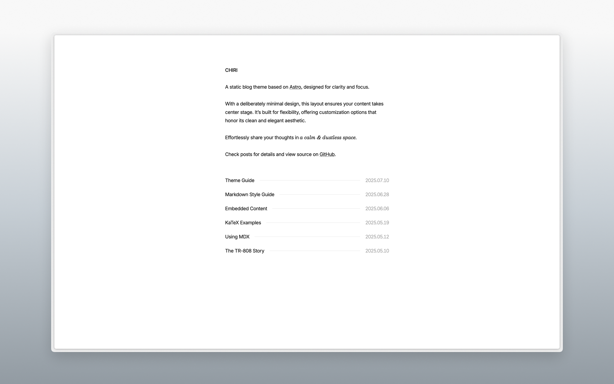

# Sora 🌌




Sora 是一个基于 [Astro](https://astro.build) 构建的极简博客主题，在保持简洁美感的同时提供了丰富的自定义选项。

查看 [演示](https://astro-sora.netlify.app/) 了解更多详情。

> [!NOTE]
> 本项目在[astro-chiri](https://github.com/the3ash/astro-chiri)的基础上进行二次开发

## 功能特性

- [x] 使用 Astro 构建
- [x] 响应式设计
- [x] 浅色/深色模式
- [x] MDX 支持
- [x] KaTeX 数学公式
- [x] 网站地图
- [x] OpenGraph 支持
- [x] RSS 订阅
- [ ] 分页功能

## 快速开始

1. [Fork](https://github.com/BaoPaper/astro-sora/fork) 这个仓库，或者使用这个模板来 [创建新仓库](https://github.com/new?template_name=astro-sora&template_owner=BaoPaper).

2. 运行以下命令:

   ```bash
   git clone <your-repo-url>

   cd <your-repo-name>

   pnpm install

   pnpm dev
   ```

3. 编辑 `src/config.ts` 和 `src/content/about/about.md` 以符合你的喜好。

4. 使用 `pnpm new <title>` 创建新文章，或将文章添加到 `src/content/posts` 目录。

5. 在部署到 Netlify、Vercel 或其他平台之前，你需要按以下方式设置适配器，但你可以在 `src/config.ts` 中将 `linkCard` 设置为 `false` 来跳过此步骤：
   - **Netlify**: `pnpm add @astrojs/netlify` 并在 `astro.config.ts` 中添加 `adapter: netlify()`。
   - **Vercel**: `pnpm add @astrojs/vercel` 并在 `astro.config.ts` 中添加 `adapter: vercel()`。
   - **Cloudflare Pages**: `pnpm add @astrojs/cloudflare` 并在 `astro.config.ts` 中添加 `adapter: cloudflare()`。
   - **静态部署 (例如 GitHub Pages)**: `pnpm add @astrojs/static` 并在 `astro.config.ts` 中添加 `adapter: static()`。
   - 参考 [Astro 部署指南](https://docs.astro.build/en/guides/deploy/) 了解更多详情。

&emsp;[](https://app.netlify.com/start) [](https://vercel.com/new) [](https://pages.cloudflare.com/start)

## 命令

- `pnpm new <title>` - 创建新文章 (使用 `_title` 创建草稿)
- `pnpm update-theme` - 更新主题到最新版本

## 参考

- https://paco.me/
- https://benji.org/
- https://shud.in/
- https://retypeset.radishzz.cc/

## 许可证

MIT
