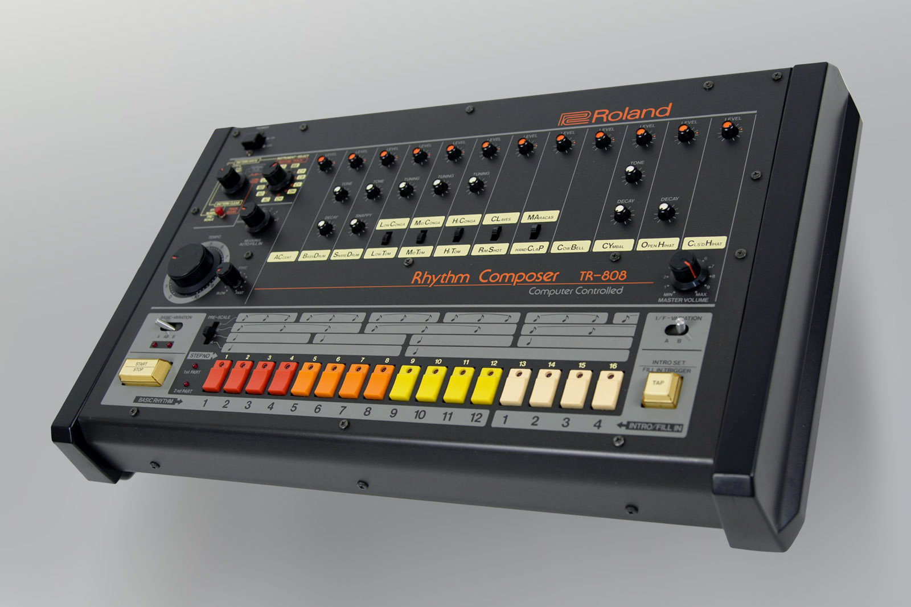

Roland TR-808 Rhythm Composer，通常简称为"808"，是有史以来最具影响力的电子乐器之一。尽管最初商业上失败，这台鼓机还是影响了整个音乐流派并成为文化象征。这是一个关于一台旨在替代鼓手的机器如何最终革新音乐制作的故事。

## 808 的诞生

在 1970 年代末，Roland 公司正在寻求创造一台价格合理的鼓机，以与昂贵的 Linn LM-1 竞争，后者是首款使用数字采样的鼓机。公司的工程师，在 **Ikutaro Kakehashi** 的领导下，着手创造一些不同的东西——一台将使用 **模拟合成** 来生成鼓声而非数字采样的机器。

开发团队面临几个挑战：

1. **成本限制** - 机器需要对家庭音乐人来说价格合理
2. **声音设计** - 仅使用模拟电路创建逼真的鼓声
3. **用户界面** - 让音乐家编程节奏变得直观

> "我们想创造一些让鼓手过时的东西，但相反，我们创造了让每个人都想成为鼓手的东西。" — Ikutaro Kakehashi

## "失败"的发布

当 TR-808 在 1980 年发布时，遇到了 **令人失望的销售**。这台机器售价 1,195 美元（约等于今天 4,000 美元），因其"不真实"的鼓声而受到批评。专业录音室更喜欢更昂贵的 Linn LM-1，它使用实际的鼓采样。

808 的模拟声音被认为过于电子化和人工：

- 底鼓太轰鸣，缺乏真实鼓声的冲击力
- 军鼓有独特的"拍手"声，听起来一点也不像真实军鼓
- 踩镲是金属味和尖锐的
- 通鼓有特征性的"boing"声音

Roland 在 1983 年停产了 TR-808，仅售出了大约 **12,000 台**，认为它是一次商业失败。

## 嘻哈革命

当 **嘻哈制作人** 发现其独特声音时，TR-808 的命运戏剧性地改变了。在 1980 年代初，纽约特别是布朗克斯的年轻制作人开始实验这台机器。

关键的早期采用者包括 **Afrika Bambaataa**，他在 "Planet Rock"（1982 年）中使用了 808，**Marley Marl** 开创了嘻哈中 808 底鼓的使用，**Rick Rubin** 将 808 声音融入早期 Def Jam 录音，以及 **The Bomb Squad** 在 Public Enemy 的制作中广泛使用 808。

808 独特的底鼓声成为了嘻哈节奏的基石。其深沉、共振的低音声可以在通过强大音响系统播放时震动整个社区。

## 迈阿密贝斯现象

在 1980 年代中期，TR-808 在 **迈阿密** 找到了另一个家，在那里它成为一种新流派 **迈阿密贝斯** 或 **Booty Bass** 的核心。制作人如 **2 Live Crew** 让 808 底鼓成为他们曲目的明星，**DJ Magic Mike** 创作了围绕 808 模式构建的整张专辑，以及 **Luke Skyywalker** 使用 808s 创造了标志性的迈阿密声音。

808 产生极低频率的能力使其完美适合在迈阿密出现的车载音响文化，在那里低音重的音乐成为了地位象征。

## 电子音乐和舞曲

TR-808 的影响力远远超出了嘻哈音乐。在 1980 年代末和 1990 年代初，它在浩室音乐和科技音乐中变得必不可少。**Frankie Knuckles** 和 **Marshall Jefferson** 在早期芝加哥浩室中使用 808s，而机器的踩镲和拍手声成为了浩室音乐的标志性声音。其可编程的序列器允许复杂的节奏模式。

在科技音乐中，**Juan Atkins**、**Derrick May** 和 **Kevin Saunderson**（Belleville 三人组）将 808s 融入底特律科技音乐。机器的未来主义声音与科技音乐的机器人美学完美契合，其价格实惠使卧室制作人也能负担得起。

## 现代音乐中的 808

即使在今天，TR-808 仍通过软件仿真和硬件重发继续影响音乐制作。**Roland Cloud** 提供官方软件版本的 808，**Native Instruments** 在其库中包含 808 采样，以及 **Ableton Live** 特色 808 启发的鼓架。

硬件重发包括 **Roland TR-08** 精品系列重发，**Roland TR-8S** 带有 808 声音的现代鼓机，以及 **Behringer RD-8** 原版的经济型克隆。

## 文化影响

TR-808 已超越其作为乐器的角色，成为 **文化象征**。它影响了时尚，以 808 启发的服装和配饰，艺术，以视觉艺术家在作品中融入 808 影像，电影，通过关于机器影响的纪录片和电影，以及文学，通过庆祝其遗产的书籍和文章。

> "808 不仅改变了音乐——它改变了文化。它为无法获得昂贵录音设备的社区发声。" — Questlove

## 持久的遗产

Roland TR-808 的故事完美示例了 **失败如何导致创新**。最初被认为是商业失败的产品成为 20 世纪最重要的音乐乐器之一。

808 故事的关键教训包括拥抱不完美（808 的"缺陷"成为其最大优势），理解可访问性的重要性（价格实惠的工具可以民主化音乐创作），认识到社区采用至关重要（用户通常会找到设计师从未想象的创造性应用），以及欣赏永恒的设计能保持数十年的相关性。

TR-808 的影响力继续增长，证明有时最具革命性的创新来自意想不到的地方。从作为"失败"鼓机的卑微开始到成为文化象征的地位，808 真正赢得了其在音乐史上的位置。

---

_TR-808 可能在 1983 年停产，但其节拍永续，激励着新一代音乐家和制作人创造明天的音乐。_
