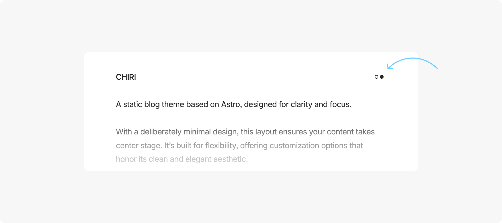
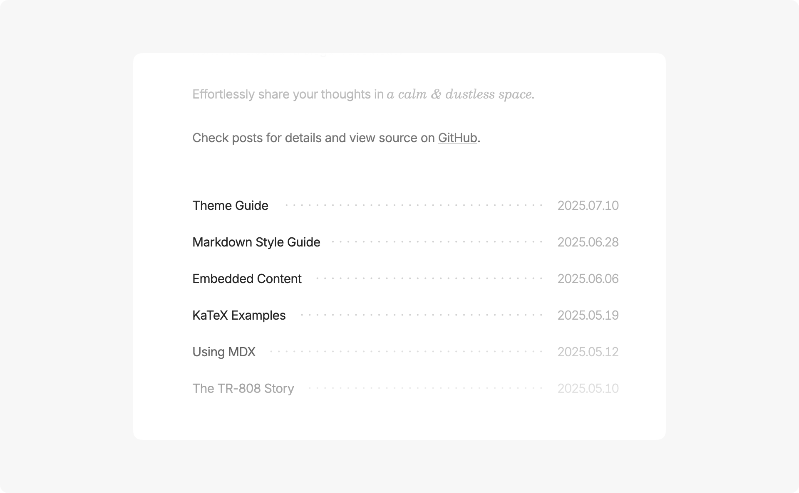
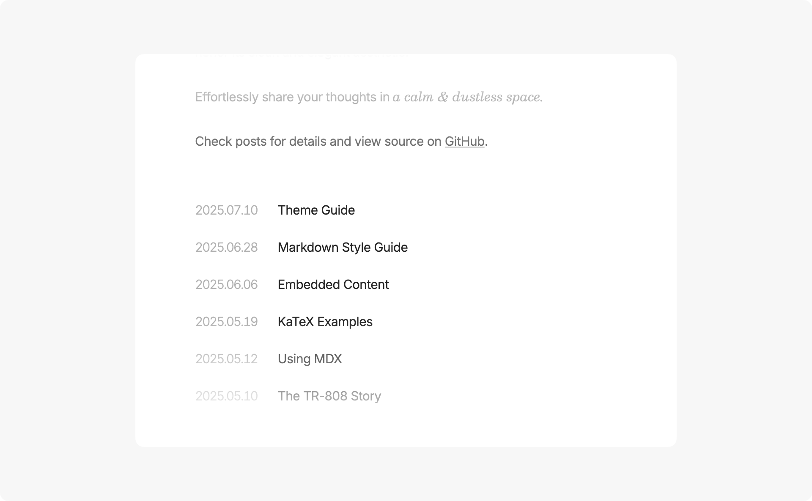
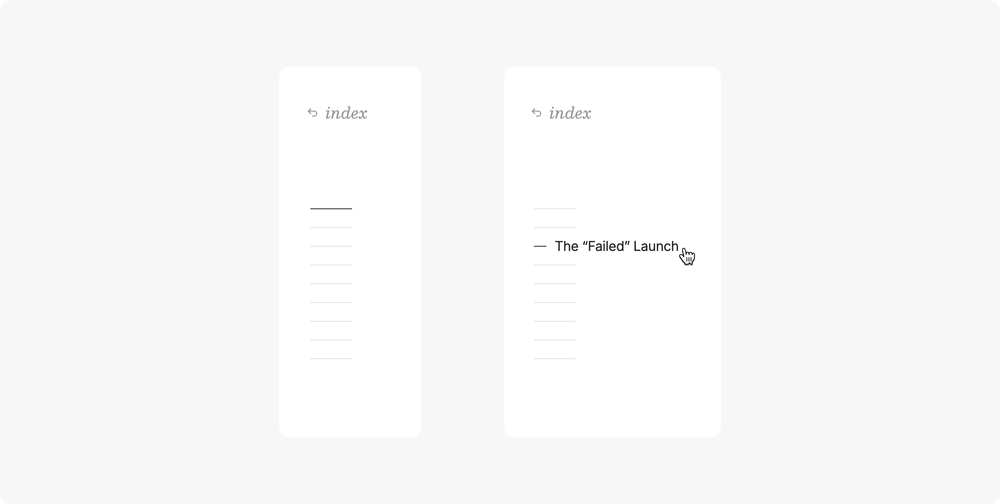
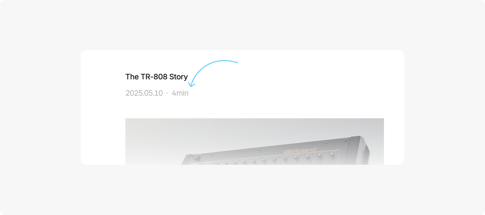
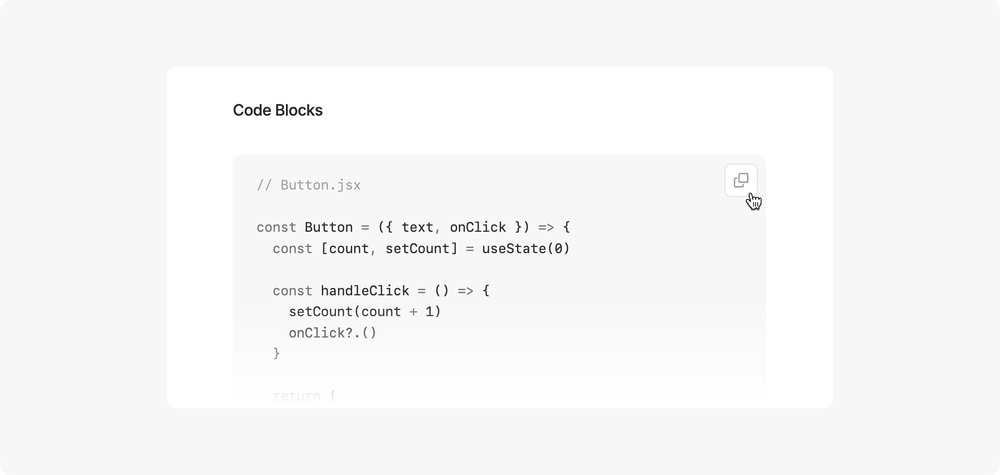

Sora 是一个基于 [Astro](https://astro.build) 构建的极简博客主题，在保持简洁美感的同时提供了丰富的自定义选项。

---

## 基本命令

- `pnpm new <title>` - 创建新文章 (使用 `_title` 创建草稿)
- `pnpm update-theme` - 将主题更新到最新版本

## 主要文件和目录

- `src/content/about/about.md` - 编辑首页的关于部分。如果不想显示任何内容，可将其留空。
- `src/content/posts/` - 所有博客文章都存储在这里
- `src/config.ts` - 配置主要站点信息和设置

```ts
// 站点信息
site: {
  website: 'https://baopaper.cn/', // 站点域名
  title: 'SORA', // 站点标题
  author: 'BaoPaper', // 作者名称
  description: '由 Astro 构建的极简博客', // 站点描述
  language: 'zh-CN' // 默认语言
},
```

```ts
// 常规设置
general: {
  contentWidth: '35rem', // 内容区域宽度
  centeredLayout: true, // 使用居中布局 (false 为左对齐)
  themeToggle: false, // 显示主题切换按钮 (默认使用系统主题)
  postListDottedDivider: false, // 在文章列表中显示点状分隔符
  footer: true, // 显示页脚
  fadeAnimation: true // 启用淡入淡出动画
},
```

```ts
// 日期设置
date: {
  dateFormat: 'YYYY-MM-DD', // 日期格式: YYYY-MM-DD, MM-DD-YYYY, DD-MM-YYYY, MONTH DAY YYYY, DAY MONTH YYYY
  dateSeparator: '.', // 日期分隔符: . - / (MONTH DAY YYYY 和 DAY MONTH YYYY 除外)
  dateOnRight: true // 文章列表中的日期位置 (true 为右侧, false 为左侧)
},
```

```ts
// 文章设置
post: {
  readingTime: false, // 在文章中显示阅读时间
  toc: true, // 显示目录 (当有足够的页面宽度时)
  imageViewer: true, // 启用图片查看器
  copyCode: true, // 在代码块中启用复制按钮
  linkCard: true // 启用链接卡片
}
```

## 文章 Frontmatter

只有 `title` 和 `pubDate` 是必需字段

```ts
---
title: '文章标题'
pubDate: '2025-07-10'
---
```

## 语法高亮

您可以通过 `astro.config.ts` 中的 `shikiConfig` 配置主题。

更多详情: [语法高亮 | Astro 文档](https://docs.astro.build/en/guides/syntax-highlighting/)

```ts
import { defineConfig } from 'astro/config'

export default defineConfig({
  markdown: {
    shikiConfig: {
      light: 'github-light',
      dark: 'github-dark',
      wrap: false
    }
  }
})
```

---

## 部分功能预览












